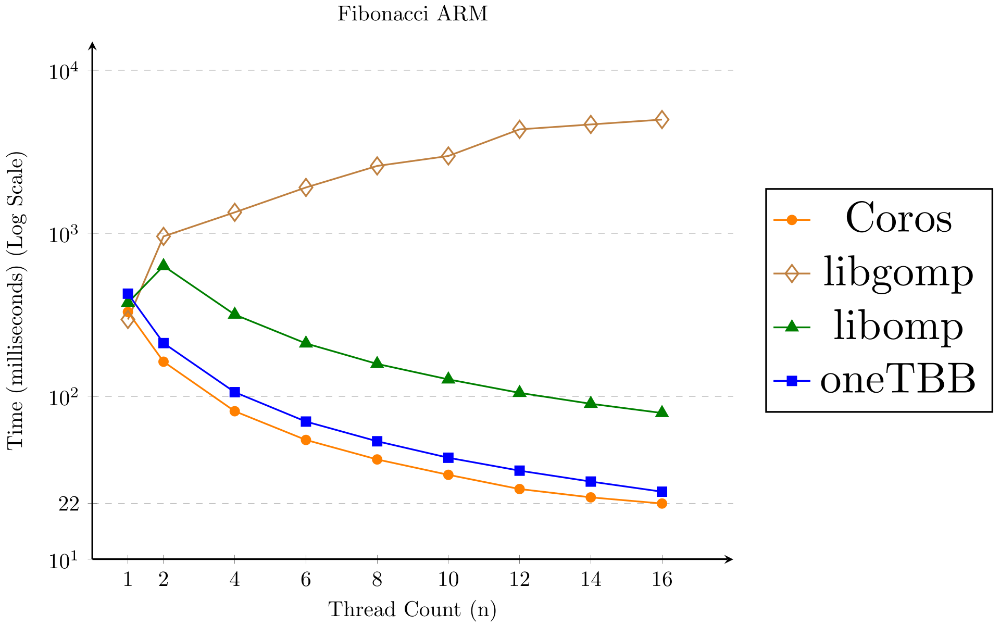

<h1 align="center">Coros</h1>

<div align="center">
    
[](https://github.com/mtmucha/coros/actions/workflows/gcc_test.yml)
[](https://github.com/mtmucha/coros/actions/workflows/clang_test.yml)
[](https://github.com/mtmucha/coros/actions/workflows/test_build.yml)
[](https://github.com/mtmucha/coros/actions/workflows/add_build.yml)
[](https://github.com/mtmucha/coros/actions/workflows/tsan_build.yml)

</div>

Coros is a header-only C++23 library designed for task-based parallelism,
that utilizes coroutines and the new expected type. Key features include:

- **Ease of use**: Straightforward interface and header-only installation.
- **Performance**: Optimized to ensure you don't miss out on performance ([see benchmarks below](#benchmarks)).
- **Exception handling**: Utilizes `std::expected` for error management.
- **Monadic operations**: Supports easy chaining of tasks with `and_then` method.

Transforming a standard sequential function into a parallel task with Coros is as simple as:

<p align="center">
  <picture>
    <source media="(prefers-color-scheme: dark)" srcset="images/what_black.png">
    <source media="(prefers-color-scheme: light)" srcset="images/what_white.png">
    
  </picture>
</p>

# Benchmarks

We have conducted two benchmarks to evaluate the performance of our library:

- **Fibonacci Calculation**: Calculating the 30th Fibonacci number to assess the scheduling overhead.
- **Matrix Multiplication**: A standard workload that tests overall performance.

### Calculating Fibonacci number

<p align="center">
  <a>
    
  </a>
  <a>
    
  </a>
</p> 

### Matrix multiplication

<p align="center">
  <a>
    
  </a>
  <a>
    
  </a>
</p> 


# Documentation

Using the Coros library is straightforward, there are three main components:

- `coros::ThreadPool`: As the name suggests, this is a thread pool that manages a desired number of worker 
                       threads and executes individual tasks.
- `coros::Task<T>`: This object serves as the task container, which must be used as the return value from tasks. 
                    The T parameter specifies the type the task returns. For a simple example, refer to the accompanying image.
- **Awaiters**: These are objects that support the `co_await` operator, allowing them to be awaited within tasks. 
                They are typically used for control flow, for example, waiting for other tasks to finish. 

For additional details about the library, refer to the documentation provided below and check out the examples in the example folder.

- [Documentation](#documentation)
- [Installation](#installation)
- [Creating tasks and starting execution](#creating-tasks-and-starting-execution)
- [Waiting for other tasks](#waiting-for-other-tasks)
- [Enqueueing tasks](#enqueueing-tasks)
- [Chaining tasks](#chaining-tasks)

# Installation

To install the Coros library, simply place the include folder into your project directory and set the include path. 
There are four key headers you can include:

- `#include "start_tasks.h"`:  Provides the functionality to set up tasks, thread pool object, and launch task execution from the main thread.
- `#include "wait_tasks.h"`: Enables suspension of individual tasks while waiting for others to complete.
- `#include "enqueue_tasks.h"`: Allows for the enqueuing of tasks into a thread pool without awaiting their completion.
- `#include "chain_tasks.h"`: Supports chaining of tasks, this chain is then executed on a thread pool.

To compile the library, ensure your compiler supports C++23 feature std::expected. Compatible compilers:

- GCC 13 or newer
- Clang 17 or newer
- MSVC (not yet supported) 

Do not forget to enable coroutines for given compiler, for example `-fcoroutines` for GCC.

> [!NOTE]
> The library uses `std::hardware_destructive_interference_size` if supported by the compiler. 
> You can also set this value manually by passing a flag to the compiler, or you may choose to ignore it. 
> This is used as an optimization to avoid false sharing.

# Creating tasks and starting execution 

To set up a task and start parallel execution the necessary steps are:

- Construct a `coros::ThreadPool`: This will be the execution environment for your tasks.
- Construct tasks using `coros::Task<T>`: Define the tasks and create a task object. These tasks can be run
  on the thread pool object.
- Start execution: Use `coros::start_sync` or `coros::start_async` to initiate execution from the main thread.


`coros::start_sync`/`coros::start_async` are functions designed to start parallel execution from the main thread.

**To create `coros::Task<T>`, `coros::ThreadPool` or use `coros::start_sync`/`coros::start_async`
 include the `#include "start_tasks"` header.**

## `coros::Task<T>`

Task is a coroutine(added in C++20) that returns a `coros::Task<T>` object. To
transform a regular function into a coroutine, instead of `return` keyword a `co_return`
keyword must be used. And to transform a coroutine into a task a `coros::Task<T>` must
be a return type of the coroutine. Tasks support two keywords :

A `coros::Task<T>` is a coroutine object, a feature introduced in C++20. To convert a standard function into a coroutine, replace the `return` keyword with `co_return`. 
Additionally, the function must specify `coros::Task<T>` as its return type to function as a task. Tasks support two keywords:

- `co_return`: Use this keyword instead of return in your return statements.
- `co_await`: Use this for flow control with awaitable objects(objects that support `co_await` operator).

The return type `T` **must satisfy** constraint `std::is_constructible<T,T>`. 
This requirement ensures that return values can be constructed from an r-value reference, utilizing either a move or a copy constructor. 
This constraint arises because coroutine parameters themselves must also satisfy the std::is_constructible<T,T> condition.

```Cpp
coros::Task<int> add_one(int val) {
  co_return val + 1;
}

int main() {
  coros::ThreadPool tp{/*number_of_threads=*/2};
  // Create the task object by calling the coroutine.
  coros::Task<int> task = add_one(41);
  // Wait until the task is finished, this call blocks.
  coros::start_sync(tp, task);
  // After this point, task is completed.
  // Optional check for stored value.
  if (task.has_value()) {
    std::cout << "Result : " << *task << std::endl;
  } else {
    // It is possible to process the caught exception.
    std::cout << "Task failed" << std::endl;
  }
}
```


> [!WARNING]
> While it's possible to use lambda coroutines to construct tasks, be cautious with captures and references. 
  Best practice is passing values and references through coroutine parameters rather than captures to ensure safety and avoid unexpected behavior. 
  For more detail [see the C++ Core Guidelines](https://isocpp.github.io/CppCoreGuidelines/CppCoreGuidelines#SScp-coro).

Under the hood, `coros::Task<T>` employs `std::expected<T, std::exception_ptr>` to store the outcome of the coroutine/task. 
This structure holds either a value, indicating successful completion, or an `std::exception_ptr` if an exception occurred. 
For convenience, `coros::Task<T>` offers methods analogous to those of std::expected:

- `T value()`: Accesses the stored value directly.
- `std::exception_ptr error()`: Retrieves the stored `std::exception_ptr`.
- `operator*()`: Provides direct access to the result.
- `T value_or(T defaultValue)`: Returns the stored value if the task contains a value; otherwise, it returns the specified default value.
- `std::expected<T, std::exception_ptr> expected()`: Returns the underlying std::expected object.
- `operator bool()`: Returns true if the task contains a successfully stored value.
- `bool has_value()`: Returns true if the task contains a successfully stored value.

> [!NOTE]
> Methods `value()` and `operator*()` **are not supported** for specialization `coros::Task<void>`.

`coros::Task<T>` supports the `co_await` operator, making it an awaitable object. 
When a task is awaited using `co_await`, it behaves similarly to a regular function call: the awaited task executes and, upon completion, control returns to the calling task. 
The difference is that this operation typically does not consume additional stack space, thanks to the coroutine-to-coroutine control transfer.

```Cpp
coros::Task<int> add_one(int val) {
  co_return val + 1;
}

coros::Task<int> add_value(int val) {
  coros::Task<int> another_task = add_one(val);
  // Once the another task finishes, control is returned,
  // this works like a regular function. 
  co_await another_task;
  // Accesses the another_task's result and increments it by one.
  // NOTE : check for the value is omitted.  
  co_return *another_task + 1;
}
```

## `coros::start_sync(coros::ThreadPool&, Tasks&&...)`

To start tasks on a thread pool, you specify the desired thread pool and the tasks to be executed. 
It is crucial that the `coros::ThreadPool` object outlives the execution of the tasks.

<details>

<summary> code example </summary>

```Cpp
coros::Task<int> add_one(int val) {
  co_return val + 1;
}

int main() {
  coros::ThreadPool tp{/*number_of_threads=*/2};
  coros::Task<int> task = add_one(41);
  coros::start_sync( 
    tp, 
    // Lambda function that does the same ad add_one. Creates a temporary task object, which means
    // we cannot access its value.
    [](int val) -> coros::Task<int> {co_return val + 1;}(41),
    task
  );
  // Cannot retrieve value from the lambda function, but can retrieve 
  // value from the task.
  std::cout << *task << std::endl; // prints : 42
}
```

</details>


## `coros::start_async(coros::ThreadPool&, Tasks&&...)`

A task can be started asynchronously from the main thread, which allows the main thread to continue working while other tasks execute on the thread pool.

<details>

<summary> code example </summary>

```Cpp
coros::Task<int> add_one(int val) {
  co_return val + 1;
}

int main() {
  coros::ThreadPool tp{/*number_of_threads=*/2};
  coros::Task<int> task = add_one(41);
  auto start_task = coros::start_async( 
    tp, 
    [](int val) -> coros::Task<int> {co_return val + 1;}(41), 
    task
  );
  //
  // Main thread can do some work.
  //
  // Call wait, blocks if tasks hasn't finished
  start_task.wait()
  std::cout << *task << std::endl; // prints : 42
}
```

</details>

# Waiting for other tasks 

The Coros library provides mechanisms to wait for other tasks to complete. 
This is achieved by suspending the current task (if necessary) and resuming it later. 
There are two main methods and their overloads for handling task waiting:

- `coros::wait_tasks(Tasks&&...)`
- `coros::wait_tasks(coros::ThreadPool&, Tasks&&...)`
- `coros::wait_tasks(std::vector<coros::Task<T>>&)`
- `coros::wait_tasks(coros::ThreadPool&, std::vector<coros::Task<T>>&)`
- `coors::wait_tasks_async(Tasks&&...)`
- `coors::wait_tasks_async(std::vector<coros::Task<T>>&)`

The main difference between the synchronous and asynchronous versions is in how they schedule tasks into a thread pool:

- The **asynchronous version** schedules tasks into a thread pool upon creation.
- The **synchronous version** schedules tasks into a thread pool only when they are explicitly `co_await`-ed.

Each of these function returns an awaitable object which can be `co_await`-ed by
calling the `co_await` operator.

**To use `coros::wait_tasks` include the `#include "wait_tasks"` header.**

## `coros::wait_tasks(Tasks&&...)`

Calling `coros::wait_tasks()` generates an awaitable object that supports the `co_await` operator. 
This can be awaited to suspend the current task, which resumes only after the specified tasks have completed. 
This approach allows individual threads to perform useful work without blocking.

<details>

<summary>code example</summary>

```Cpp
coros::Task<int> add_one(int val) {
    co_return val + 1;
}

coros::Task<int> add_to_number(int val) {
  coros::Task<int> task = add_one(val);
  // The current task is suspended until task add_one completes.
  co_await coros::wait_tasks(task);
  co_return *task;
}
```

</details>

## `coros::wait_tasks(coros::ThreadPool&, Tasks&&...)` 

`coros::wait_task()` accepts variable number of tasks and it is also possible to specify
the `coros::ThreadPool&` parameter, which moves tasks between thread pools. 
Once the awaiting tasks are finished, the task is resumed on the specified thread pool.

The `coros::wait_tasks()` function can accept a variable number of tasks, and it also allows for specifying a `coros::ThreadPool&`. 
This makes it possible to move tasks between thread pools. 
Once the tasks being awaited are completed, the awaiting task resumes on the specified thread pool.

<details>

<summary> code example </summary>

```Cpp
coros::ThreadPool tp{/*number_of_threads=*/2};

coros::Task<int> add_one(int val) {
    co_return val + 1;
}

coros::Task<int> add_to_number(int val) {
  
  coros::Task<int> task = add_one(val);
  // The awaitable returned from the function can be directly co_awaited or 
  // stored into a variable and co_awaited later.
  auto awaitable = coros::wait_tasks(tp, task);
  // Store awaitable into a variable and suspend later.
  co_await awaitable;
  // This part is resumed on the thread pool specified by the
  // parameter.
  co_return *task;
}
```

</details>


## `coros::wait_tasks(std::vector<coros::Task<T>>&)` 

It's possible to pass a vector of `coros::Task<T>` into the `coros::wait_tasks()` function to await the completion of multiple tasks. 
This version **can also move tasks between thread pools** if a thread pool parameter is specified.

<details> 

<summary> code example </summary>

```Cpp
coros::Task<int> add_one_and_sum(int n) {
  std::vector<coros::Task<int>> vec;
  for (size_t i = 1; i <= n;i++) {
    // Constructs tasks with lambda function.
    // Simple task that adds one to passed parameter.
    vec.push_back(
      [](int num) -> coros::Task<int> {
        co_return num + 1;
      }(i)
    );
  }
  // Suspends the current task and is resumed once all tasks are finished.
  co_await coros::wait_tasks(vec);

  int result_sum = 0;
  for (auto& task : vec) {
    result_sum += *task;
  }

  co_return result_sum;
};
```

</details>

## `coros::wait_tasks_async(Tasks&&...)`

This function operates similarly to `coros::wait_tasks`, with the primary distinction being that the async version schedules the tasks as soon as the 
awaitable is created(when `coros::wait_tasks_async` is called). 
Note that the async version **does not support moving tasks between thread pools**. When the awaitable is `co_await`-ed, one of two scenarios may occur:

- If all tasks are already completed, the task is not suspended and continues execution immediately.
- If at least one task has not yet finished, the task is suspended and will resume once all tasks have completed.


<details>

<summary> code example </summary>

```Cpp
coros::Task<int> add_one(int val) {
    co_return val + 1;
}

coros::Task<int> add_to_number(int val) {
  coros::Task<int> task = add_one(val);
  auto awaitable = coros::wait_tasks_async(task);
  // Store awaitable into a variable and suspend later.
  //
  // Do some work.
  //
  // Checks if the task have already finished, if not it suspends the task.
  co_await awaitable;
  co_return *task;
}
```

</details>

## `coros::wait_tasks_async(std::vector<coros::Task<T>>&)` 

A `std::vector<coros::Task<T>>` can be passed into `coros::wait_tasks_async`, similar to its non-async counterpart. 

<details>

<summary> code example </summary>

```Cpp
coros::Task<int> add_one_and_sum(int n) {
  std::vector<coros::Task<int>> vec;
  for (size_t i = 1; i <= n;i++) {
    // Constructs tasks with lambda function.
    vec.push_back(
      [](int num) -> coros::Task<int> {
        co_return num + 1;
      }(i)
    );
  }
  // Async version can also be directly co_await-ed.
  co_await  coros::wait_tasks_async(vec);
  
  int result_sum = 0;
  for (auto& task : vec) {
    result_sum += *task;
  }

  co_return result_sum;
};
```

</details>

# Enqueueing tasks

Contrary to to awaiting tasks with `coros::wait_tasks` or `coros::wait_tasks_async` 
is `coros::enqueue_tasks`, which schedules tasks into a threadpool without waiting for them.
Given that these tasks are not awaited, their results cannot be retrieved and
any exception thrown inside these tasks is immediately rethrown.

Unlike `coros::wait_tasks` or `coros::wait_tasks_async`, which suspend the current task until others are completed, `coros::enqueue_tasks` 
schedules tasks into a threadpool without awaiting their completion. 
Since these tasks are not awaited, their results cannot be retrieved directly, and any exceptions thrown within these tasks are immediately rethrown.

Overloads for the `coros::enqueue_tasks` are : 

- `enqueue_tasks(Tasks&&...)`
- `enqueue_tasks(coros::ThreadPool&, Tasks&&...)`
- `enqueue_tasks(std::vector<coros::Task<T>>&&)`
- `enqueue_tasks(coros::ThreadPool&, std::vector<coros::Task<T>>&&)`

All these functions are constrained to **only accept r-value references** 
because the tasks are enqueued and not awaited, which means their `coros::Task<T>` objects are temporary(destroyed when finished) and cannot be used to retrieve values.

**To use `coros::enqueue_tasks` include the `#include "enqueue_tasks"` header.**

## `coros::enqueue_tasks(Tasks&&...)`

<details>

<summary> code example </summary>

```Cpp
std::atomic<int> counter = 0;

coros::Task<void> add_one() {
  counter++; // Atomic operation to increase the counter.
  co_return;
}

coros::Task<void> increase_counter() {
  coros::enqueue_tasks(add_one(), add_one());
  co_return;
}

int main() {
  coros::ThreadPool tp{2};
  coros::Task<void> t = increase_counter();
  coros::start_sync(tp, t);
  // The resulting counter value can be 0, 1, or 2. The increase_counter
  // task is finished at this point; however, this does not guarantee
  // that the add_one tasks have also completed their execution.
  std::cout << counter.load() << std::endl;
}
```

</details>

## `coros::enqueue_tasks(coros::ThreadPool&, Tasks&&...)`


<details>


<summary> code example </summary>

```Cpp
std::atomic<int> counter = 0;

coros::Task<void> add_one() {
  counter++;
  co_return;
}

coros::Task<void> increase_counter(coros::ThreadPool& tp) {
  // Both tasks will be executed on the specified thread pool.
  coros::enqueue_tasks(tp, add_one(), add_one());
  co_return;
}

int main() {
  coros::ThreadPool tp{2};
  coros::ThreadPool tp2{2};
  coros::Task<void> t = increase_counter(tp2);
  coros::start_sync(tp, t);
  // The resulting counter value can be 0, 1, or 2. The increase_counter
  // task is finished at this point; however, this does not guarantee
  // that the add_one tasks have also completed their execution.
  std::cout << counter.load() << std::endl;
}
```

</details>

## `coros::enqueue_tasks(std::vector<coros::Task<T>>&&)`


<details>

<summary> code example </summary>

```Cpp
std::atomic<int> counter = 0;

coros::Task<void> add_one() {
  counter++;
  co_return;
}

coros::Task<void> increase_counter() {
  std::vector<coros::Task<void>> vec;
  vec.push_back(add_one());
  vec.push_back(add_one());
  coros::enqueue_tasks(std::move(vec));
  co_return;
}

int main() {
  coros::ThreadPool tp{2};
  coros::Task<void> t = increase_counter();
  coros::start_sync(tp, t);
  // The resulting counter value can be 0, 1, or 2. The increase_counter
  // task is finished at this point; however, this does not guarantee
  // that the add_one tasks have also completed their execution.
  std::cout << counter.load() << std::endl;
}
```

</details>


# Chaining tasks

The Coros library supports a monadic operation with the `and_then` method, similar to `std::expected`, but with a key difference: 
the Coros version executes the chain of tasks on a thread pool. 
If an exception occurs during the chain, it is captured into the result, and the chain is halted. The resulting type of this operation is `std::expected`. 
There are three overloads for this function:

- `coros::chain_tasks(T&&)`: Starts a chain of tasks with a value.
- `coros::chain_tasks(coros::Task<T>&&)`: Starts a chain of tasks with a 
                                           **unstarted** task
- `coros::chain_tasks(std::expected<T, std::exception_ptr>&&)`: Starts a chain
   of tasks with an expected value

**All of these overloads accept r-value references**.
Given that this operation mimics monadic behavior, each task in the chain must accept exactly one argument. 
Additionally, it must be possible to construct the argument of each subsequent task with the result from the previous task.

**To use `coros::chain_tasks` include the `#include "chain_tasks"` header.**

## `coros::chain_tasks(T&&)`

One way to start a task chain is by passing a starting value. The function requires an `r-value reference`, indicating that the starting value should be movable,
or copyable through r-value reference. 

<details>

<summary> code example </summary>

```Cpp
coros::Task<int> add_two(int val) {
  co_return val + 2;
}

coros::Task<int> multiply_by_six(int val) {
  co_return val * 6;
}

coros::Task<int> compute_value() {
  // Each task must accept exactly one argument.
  // Each subsequent task's parameter must be
  // constructible from the previous task return value.
  std::expected<int, std::exception_ptr> res = 
    co_await coros::chain_tasks(3).and_then(add_two)
                                  .and_then(add_two)
                                  .and_then(multiply_by_six);
  if (res.has_value()) {
    // Return the computed value if the chain completes successfully.
    co_return *res;
  } else {
    // In case the chain did not successfully finish, an exception occurred.
    co_return -1;
  }
}
```

</details>

## `coros::chain_tasks(coros::Task<T>&&)`

It is also possible to start a chain with **unstarted** `coros::task<T>` object. 
The unstarted task will be executed first and then each subsequent task.

It is possible to initiate a task chain with an unstarted `coros::Task<T>`. 
The chain will start by executing this unstarted task, followed by each subsequent task in the sequence.

<details>

<summary> code example </summary>

```Cpp
coros::Task<int> add_two(int val) {
  co_return val + 2;
}

coros::Task<int> multiply_by_six(int val) {
  co_return val * 6;
}

coros::Task<int> return_three() {
  co_return 3;
}

coros::Task<int> compute_value() {
  // Each task must accept exactly  most one argument.
  // Each subsequent task's parameter must be
  // constructible from the previous task return value.
  std::expected<int, std::exception_ptr> res = 
    co_await coros::chain_tasks(return_three()) // Initializes the chain with a task that returns 3.
        .and_then(add_two)  // First subsequent operation, adds two to the value 3.
        .and_then(add_two)
        .and_then(multiply_by_six);

  if (res.has_value()) {
    // Return the computed value if the chain completes successfully.
    co_return *res;
  } else {
    // In case the chain did not successfully finish, an exception occurred.
    co_return -1;
  }
}
```

</details>

## `coros::chain_tasks(std::expected<T, std::exception_ptr>&&)`

This overload is particularly useful when you need to start a new chain from the result of a previous chain, 
potentially extending the computation or handling with new tasks.

<details>

<summary> code example </summary>

```Cpp
coros::Task<int> add_two(int val) {
  co_return val + 2;
}

coros::Task<int> multiply_by_six(int val) {
  co_return val * 6;
}

coros::Task<int> return_three() {
  co_return 3;
}

coros::Task<int> compute_value() {
  std::expected<int, std::exception_ptr> res = 
    co_await coros::chain_tasks(return_three()).and_then(add_two)
                                               .and_then(add_two)
                                               .and_then(multiply_by_six);
  if (res.has_value()) {
    // Return the computed value if the chain completes successfully.
    auto another_res = co_await coros::chain_tasks(std::move(res)).and_then(add_two);
    co_return *another_res; // returns 44
  } else {
    // In case the chain did not successfully finish, an exception occurred.
    co_return -1;
  }
}
```

</details>

# References

- [Concurrent deque](https://github.com/cameron314/concurrentqueue?tab=readme-ov-file): Used in the project as part of the scheduling algorithm.
- [Deque implementation](https://inria.hal.science/hal-00802885/document): Used as a reference for implementing our own double-ended queue.
- [Lewis Baker's blog](https://lewissbaker.github.io/): Provides excellent explanations of coroutines.

# Licence

Boost Software License - Version 1.0 - August 17th, 2003

Permission is hereby granted, free of charge, to any person or organization
obtaining a copy of the software and accompanying documentation covered by
this license (the "Software") to use, reproduce, display, distribute,
execute, and transmit the Software, and to prepare derivative works of the
Software, and to permit third-parties to whom the Software is furnished to
do so, all subject to the following:

The copyright notices in the Software and this entire statement, including
the above license grant, this restriction and the following disclaimer,
must be included in all copies of the Software, in whole or in part, and
all derivative works of the Software, unless such copies or derivative
works are solely in the form of machine-executable object code generated by
a source language processor.

THE SOFTWARE IS PROVIDED "AS IS", WITHOUT WARRANTY OF ANY KIND, EXPRESS OR
IMPLIED, INCLUDING BUT NOT LIMITED TO THE WARRANTIES OF MERCHANTABILITY,
FITNESS FOR A PARTICULAR PURPOSE, TITLE AND NON-INFRINGEMENT. IN NO EVENT
SHALL THE COPYRIGHT HOLDERS OR ANYONE DISTRIBUTING THE SOFTWARE BE LIABLE
FOR ANY DAMAGES OR OTHER LIABILITY, WHETHER IN CONTRACT, TORT OR OTHERWISE,
ARISING FROM, OUT OF OR IN CONNECTION WITH THE SOFTWARE OR THE USE OR OTHER
DEALINGS IN THE SOFTWARE.

